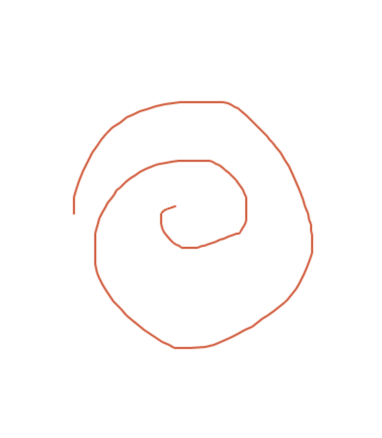
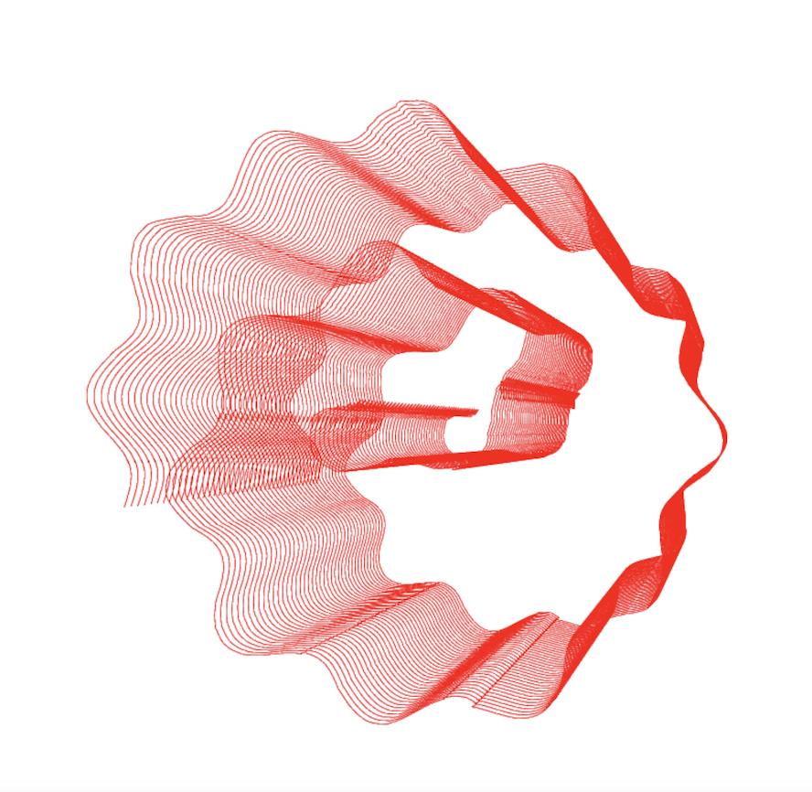

# PaintToHeight
Draw on 2d canvas and see the result replicated on different heights in 3d

https://erasta.github.io/PaintToHeight/

You draw this on the left side:

And you get this on the right side:

